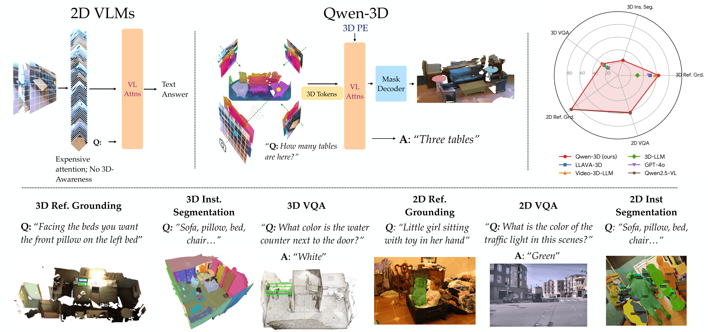

<div align="center">
<br>
<h3>Qwen-3D: A Generalist 3D Vision-Language Model for Spatial Understanding</h3>



<br>
<br>

[Lucy Lin](https://ll220.github.io/)<sup>\*</sup>&nbsp;
[Ayush Jain](https://ayushjain1144.github.io/)<sup>\*</sup>&nbsp;
[Yifan Liu](https://liuyifan22.github.io/)&nbsp;
[Katerina Fragkiadaki](https://www.cs.cmu.edu/~katef/)&nbsp;
<br>

Carnegie Mellon University

[](https://qwen-3d.github.io/)
[](https://arxiv.org/abs/2608.02980)
[](https://huggingface.co/katefgroup/Qwen-3D)
[](https://huggingface.co/datasets/katefgroup/qwen3d_cached_scannet_vit_features)

</div>

## Installation

Install dependencies:
```bash
conda create -n qwen3d python=3.12
conda activate qwen3d

# (Optional) If no CUDA is installed 
conda install cuda cuda-nvcc -c nvidia/label/cuda-12.9.0
export LD_LIBRARY_PATH="$CONDA_PREFIX/lib:$LD_LIBRARY_PATH"
export CUDA_HOME=$CONDA_PREFIX

pip install torch==2.12.1 torchvision==0.27.1 --index-url https://download.pytorch.org/whl/cu129
pip install torch-scatter --no-build-isolation
pip install 'git+https://github.com/facebookresearch/detectron2.git' --no-build-isolation
pip install git+https://github.com/facebookresearch/pytorch3d.git@stable --no-build-isolation
bash docs/init.sh
pip install -r requirements.txt
python -m spacy download en_core_web_sm
python -c 'import nltk; nltk.download("stopwords")'
```

For instructions on how to download and pre-process the data, see [docs/DATA.md](docs/DATA.md).

### Checkpoints

Download pretrained Qwen-3D weights from [Hugging Face](https://huggingface.co/katefgroup/Qwen-3D/tree/main):

```bash
mkdir -p ckpts
hf download katefgroup/Qwen-3D qwen3d_3b.pth --local-dir ckpts
hf download katefgroup/Qwen-3D qwen3d_7b.pth --local-dir ckpts
```

Use the checkpoint that matches your backbone (`QWEN_MODEL`):

| Checkpoint | Backbone |
| --- | --- |
| `ckpts/qwen3d_3b.pth` | `Qwen/Qwen2.5-VL-3B-Instruct` (default) |
| `ckpts/qwen3d_7b.pth` | `Qwen/Qwen2.5-VL-7B-Instruct` |

Load weights with `MODEL.WEIGHTS` (and match `QWEN_MODEL`), for example:

```bash
CKPT_PATH="ckpts/qwen3d_3b.pth"
# add to your train/eval command:
MODEL.WEIGHTS "$CKPT_PATH" \
QWEN_MODEL "Qwen/Qwen2.5-VL-3B-Instruct"
```

For evaluation-only runs, set `EVAL_ONLY=1` (see [docs/RUN.md](docs/RUN.md)).

### Cached ScanNet ViT Features

Optional precomputed Qwen2.5-VL ViT features for ScanNet RGB frames are available on [Hugging Face](https://huggingface.co/datasets/katefgroup/qwen3d_cached_scannet_vit_features). Enabling them skips the ViT forward on cache hits and speeds up ScanNet training.

```bash
hf download katefgroup/qwen3d_cached_scannet_vit_features --local-dir ./qwen3d_cached_scannet_vit_features

FEATURE_DIR="/path/to/scannet_image_qwen_features"
mkdir -p "$FEATURE_DIR"
tar -xf ./qwen3d_cached_scannet_vit_features/scannet_image_qwen_features_3b.tar -C "$FEATURE_DIR"
tar -xf ./qwen3d_cached_scannet_vit_features/scannet_image_qwen_features_7b.tar -C "$FEATURE_DIR"
```

Each archive unpacks under a backbone prefix, yielding:

```text
FEATURE_DIR/
  3b/<scene_id>/<frame>.pt
  7b/<scene_id>/<frame>.pt
```

Point training at the **parent** `FEATURE_DIR` (the code resolves `3b` / `7b` from `QWEN_MODEL`):

```bash
CACHE_QWEN_FEATURES True \
FEATURE_DIR "/path/to/scannet_image_qwen_features" \
QWEN_MODEL "Qwen/Qwen2.5-VL-3B-Instruct"
```

Caching applies to ScanNet datasets only. Leave `CACHE_QWEN_FEATURES False` (default) if you are not using cached features. To rebuild the cache yourself, see [docs/cache_qwen_vit_features.py](docs/cache_qwen_vit_features.py) and [docs/RUN.md](docs/RUN.md).

### Training and Evaluation

See [docs/RUN.md](docs/RUN.md) for training and evaluation commands.

### General Usage 

- Modify `DETECTRON2_DATASETS` to the path where you store the Posed RGB-D data. You might also need to change 3D Mesh point cloud paths (like `SCANNET_DATA_DIR`) for each script. You may want to find these variables in `qwen3d/config.py` and permanently modify these paths.
- To load pretrained Qwen-3D weights, set `MODEL.WEIGHTS` to a downloaded checkpoint (see [Checkpoints](#checkpoints)) and match `QWEN_MODEL`. For evaluation, set `EVAL_ONLY=1`.
- Optionally enable cached ScanNet ViT features with `CACHE_QWEN_FEATURES True` and `FEATURE_DIR` (see [Cached ScanNet ViT Features](#cached-scannet-vit-features)).
- `SOLVER.IMS_PER_BATCH` controls the batch size. This is effective batch size i.e. if you are running on 2 GPUs and the batch size is set to 6, you are using bs=3 per GPU. 
- `SOLVER.TEST_IMS_PER_BATCH` controls the (effective) test batch size. Since, there are variable number of images in a scene, we use bs=1 per GPU at test time. `MAX_FRAME_NUM=-1` means that it loads all images in a scene for inference, which is our usual strategy. In some datasets, the images can simply be too large, thus there we actually set a maximum limit on images. 
- `INPUT.SAMPLING_FRAME_NUM` controls the number of images we sample at test time -- for eg. in ScanNet, we train on 25 image chunks at training time. 
- `CHECKPOINT_PERIOD` is the number of iterations after which a checkpoint is saved. `EVAL_PERIOD` specifies the number of steps after which the eval is run. 
- `OUTPUT_DIR` stores the checkpoints and the tensorboard logs. `--resume` resumes the training from the last checkpoint stored in `OUTPUT_DIR`. If no checkpoint is present, it loads the weights from `MODEL.WEIGHTS`
- The `DATASETS.TRAIN` and `DATASETS.TEST` flags control the datasets in the training and evaluation set. Check [docs/RUN.md](docs/RUN.md) for scripts with various combinations of training sets and the flags associated with them. 
- `BS`, `BS2D`, `BS3D`, and `BBS` all control the batch sizes with various training setups. We train with `batch_size=1` due to memory constraints - the current model forward will not accept different batch sizes. We are looking to fix this later. 


## Citation

```bibtex
@inproceedings{lin2026qwen3d,
  title     = {Qwen-3D: A Generalist 3D Vision-Language Model for Spatial Understanding},
  author    = {Lin, Lucy and Jain, Ayush and Liu, Yifan and Fragkiadaki, Katerina},
  booktitle = {European Conference on Computer Vision (ECCV)},
  year      = {2026}
}
```

## Credits

- [3D Diffuser Actor](https://github.com/nickgkan/3d_diffuser_actor)
- [UniVLG](https://github.com/facebookresearch/univlg)
- [Mask2Former](https://github.com/facebookresearch/Mask2Former)
- [ODIN](https://github.com/ayushjain1144/odin)

